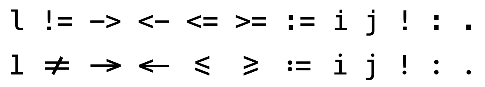
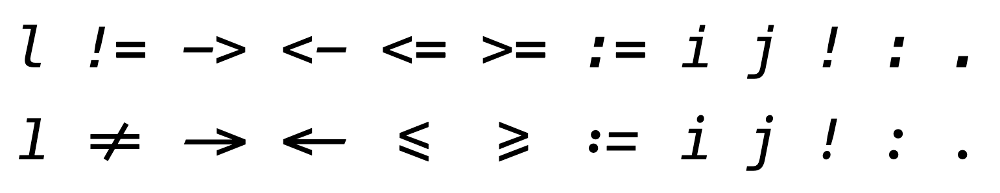
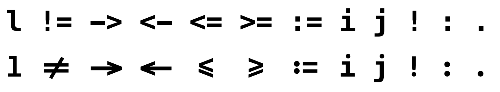

# Menlo Ligatures Font

基于 [Meslo Font](https://github.com/andreberg/Meslo-Font) 的一款字体，在其基础上添加一些连字。

当前是基于 Meslo LG L 号字体，字体间距比较大。

## 主要的变动

常规体： 

斜体：

粗体：

- `l` 替换成 SF Mono 中的 `l`，并适当地加粗。
- 添加 `!=`, `->`, `<-`, `<=`, `>=`, `:=` 的连字。
- 将 `i`, `j`, `!`, `:` 的点改成圆点。
